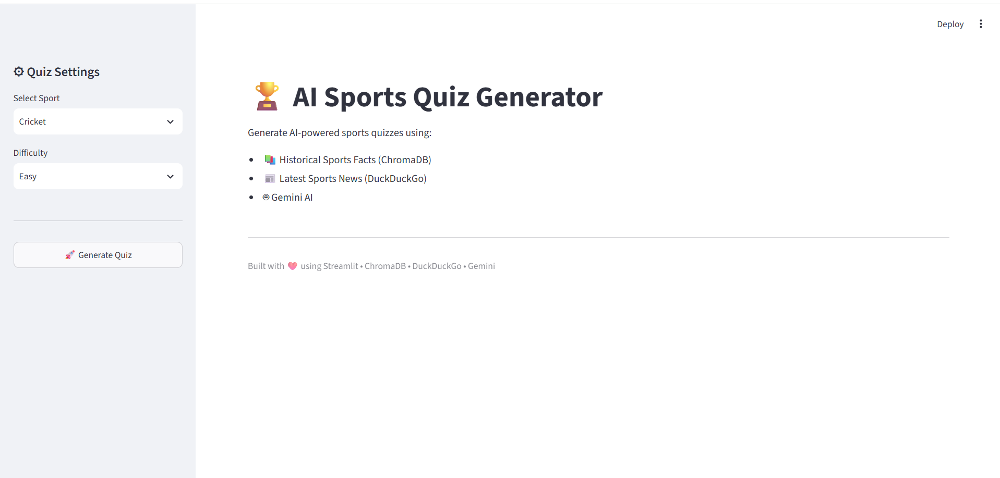
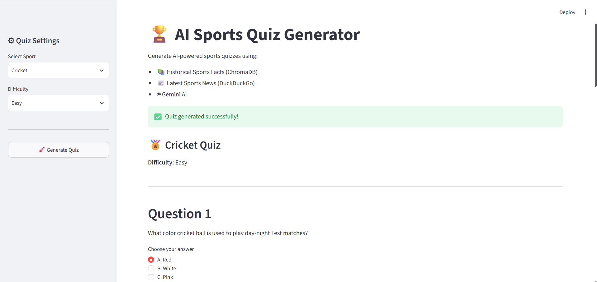
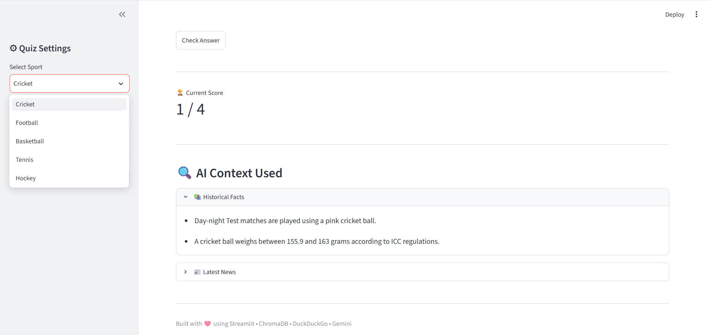
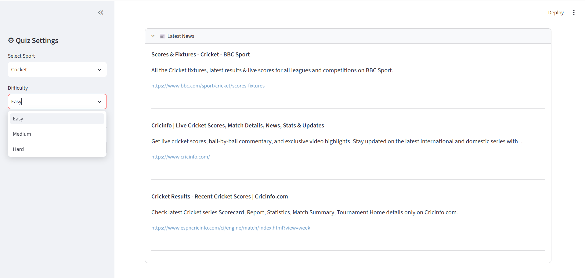

## 🏆 AI-Powered Sports Quiz Generator

An AI-powered Sports Quiz Generator that creates dynamic multiple-choice quizzes by combining historical sports facts stored in ChromaDB with the latest sports news retrieved from DuckDuckGo. The application uses Retrieval-Augmented Generation (RAG) and Google's Gemini AI to generate engaging, context-aware quizzes through an interactive Streamlit interface.

---

## 📌 Overview

This project demonstrates how Retrieval-Augmented Generation (RAG) can be used to build intelligent applications.

Instead of relying only on an LLM, the application retrieves:

- Historical sports facts from ChromaDB
- Latest sports news from DuckDuckGo

These are combined into a prompt and sent to Gemini AI, which generates personalized sports quizzes.

---

## ✨ Features

- ✅ AI-generated sports quizzes
- ✅ Retrieval-Augmented Generation (RAG)
- ✅ ChromaDB vector database
- ✅ DuckDuckGo live sports news search
- ✅ Google Gemini AI integration
- ✅ Interactive multiple-choice quiz interface
- ✅ Historical + live sports context
- ✅ Difficulty selection (Easy / Medium / Hard)
- ✅ Multiple sports support
- ✅ Streamlit web application

---

## 🏗️ Architecture

```

                User
                  │
                  ▼
          Streamlit UI (app.py)
                  │
                  ▼
        generate_quiz() (generator.py)
           ┌──────────────┴──────────────┐
           ▼                             ▼
    ChromaDB                     DuckDuckGo
(Historical Facts)              (Latest News)
           └──────────────┬──────────────┘
                          ▼
                     Gemini AI
                          ▼
                 Generated Quiz
                          ▼
                  Streamlit UI

```

---

## 🛠️ Tech Stack

| Technology | Purpose |
|------------|----------|
| Python | Backend |
| Streamlit | Web Interface |
| Gemini AI | Quiz Generation |
| ChromaDB | Vector Database |
| DuckDuckGo (DDGS) | Live News Search |
| Sentence Transformers | Embeddings |
| python-dotenv | Environment Variables |

---

## 📂 Project Structure

```

sports-quiz-agent/
│
├── app.py
├── README.md
├── requirements.txt
├── .env
│
├── data/
│   └── sports_facts.json
│
├── chroma_db/
│
├── src/
│   ├── config.py
│   ├── database.py
│   ├── generator.py
│   └── search.py
│
├── test_database.py
├── test_generator.py
└── test_search.py

```

---

## 🚀 Installation

### Clone the repository

```bash
git clone https://github.com/<your-username>/sports-quiz-agent.git
```

```bash
cd sports-quiz-agent
```

### Create a virtual environment

```bash
python -m venv venv
```

### Windows

```bash
venv\Scripts\activate
```

### Linux / macOS

```bash
source venv/bin/activate
```

### Install dependencies

```bash
pip install -r requirements.txt
```

---

## 🔑 Environment Variables

Create a `.env` file in the project root.

```env
GEMINI_API_KEY=YOUR_API_KEY
```

---

## ▶️ Run the Application

```bash
streamlit run app.py
```

The application will open in your browser at:

```
http://localhost:8501
```

---

## 🖼️ Screenshots

### Home Page



---

### Generated Quiz



---

### Historical Facts



---

### Latest Sports News



---

### 📈 Future Improvements

- Authentication
- Leaderboard
- Score history
- Timer-based quizzes
- Voice-enabled quiz
- More sports datasets
- Personalized recommendations
- AI explanations with references

---

## 🎯 Learning Outcomes

This project demonstrates:

- Retrieval-Augmented Generation (RAG)
- Vector Databases
- Prompt Engineering
- Large Language Model Integration
- Semantic Search
- AI-powered Application Development
- Streamlit Frontend Development

---